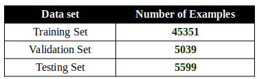
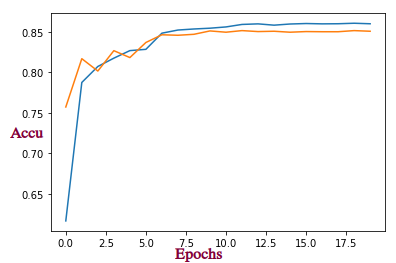
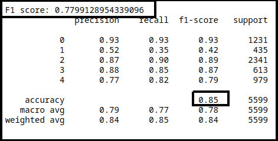
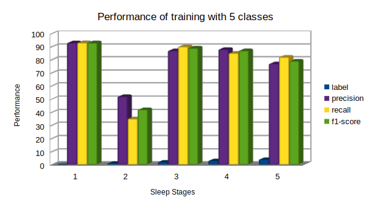
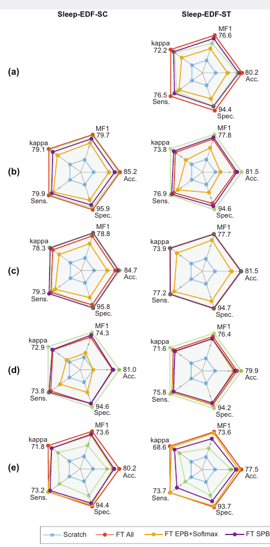

**Author**: Rumana Sultana
# Sleep-Staging
Automatic sleep stage classification based on single channel EEG using compressed/distributed DL model to use in an edge device with limited resources

**Database to use:** -Sleep-EDF expanded database(base model)   
&emsp;  &emsp;  &emsp;&emsp;  &emsp;  &emsp;&emsp; **Description:** 197 whole-night Polysomnographic sleep recordings, 
Including EEG, EOG, Chin EMG, and event 
 &emsp;  &emsp; &emsp;  &emsp; &emsp;&emsp;  &emsp;markers. 
 &emsp;  &emsp; &emsp;  &emsp; &emsp;&emsp;  &emsp;-Sleep-EDF-ST dataset(target model)
 &emsp;  &emsp; &emsp;  &emsp; &emsp;&emsp;  &emsp;**Description:** 44 ST*files of temazepam effects on sleep in 22 Caucasians males and 	females, difficulty with  &emsp;  &emsp; &emsp;  &emsp; &emsp;&emsp;  &emsp;falling asleep.

**Technology to use:**  Convolutional neural network(for source model development),  
                        &emsp; &emsp; &emsp; &emsp; &emsp; &emsp;&emsp;&emsp;Deep Transfer Learning (for finetune to target domain)  

**Platforms:** MATLAB (for data preparation), Python3, TensorFlow 2 for network training and evaluation, NumPy, SciPy, sklearn, h5py, etc. 

**Description of Project:**  In this project, two main tasks are included. First one is developing and training a base model with a big data set that would be used as a pretrained model later into target domain. And the second one is to fine tune the trained model with a same type different small data set into the target domain. A target domain could be a device with less memory or other less CPU configuration. 
 
   &emsp;  &emsp;  &emsp;&emsp; &emsp;  &emsp;  &emsp;&emsp;   
 
&emsp;&emsp;&emsp;&emsp;&emsp;&emsp; &emsp;&emsp;&emsp;&emsp;&emsp;&emsp;&emsp;&emsp;&emsp;**Figure 1: Basic Idea of the Project**  
 
**Work Done Under the Project:**  (1) Cirrently, I have trained the base model with sleep-edfx data set. The base model contains ten 1-dimentional convolution layers and five maxpolling layers alongwith fully connected layers. The fully connected layer is connected to the 5 classes of sleep stages. The layers of base model is shown in figure below. 
 
&emsp;    &emsp;  &emsp;  &emsp;  
 
     &emsp;  &emsp;  &emsp;&emsp;  &emsp;  &emsp; &emsp;  &emsp; &emsp;  &emsp;  &emsp; &emsp; &emsp; **Figure 2: Layers of Base Model**
  
**Result Analysis of Base Model:** The base model is trained for 30 epochs with pre-processed sleep data set. In Table 1, the number of examples are given used in the training. In one training no filtering is applied and the other is trained with filtered data by **Butterworth filtering** function (20 epochs done). For the both training I got above 85% accuracy with F1 score 78. My analysis is the second training accuracy would be higher than the first one if 100 epochs could be finished. The loss was used **categorical_crossentropy** and the optimizer is **adam** in both training session. The loss and validation loss with epochs is shown in Figure 3 (training 1) and the accuracy and validation accuracy with epochs is shown in Figure 4 (training 2). The performance of training is shown in Figure 5 and the visualization is shown in Figure 6. The labels clarification for visualization is 0->1, 1->2, 2->3, 3->4, 4->5. [Note: The LibreOffice Calc change the numbers even I gave it in correct sequence].
  
&emsp;  &emsp;  &emsp;&emsp;  &emsp;  &emsp;&emsp;  &emsp;  &emsp;&emsp;  &emsp;&emsp;  **Table 1: Number of examples used in training** 
&emsp;  &emsp;  &emsp;&emsp;  &emsp;  &emsp;&emsp;  &emsp;  &emsp;&emsp;&emsp;
  
&emsp;  &emsp;  &emsp; &emsp;  &emsp;  &emsp;&emsp;  
&emsp;&emsp;&emsp;&emsp;&emsp;&emsp;**Figure 3: Loss Visulization with Epochs** &emsp;&emsp;&emsp; &emsp;&emsp; &emsp; &emsp;**Figure 4: Accuracy Visulization with Epochs** 
  
&emsp;  &emsp;  &emsp;&emsp;  &emsp;  &emsp;&emsp;&emsp;  &emsp;  &emsp; &emsp;  &emsp;&emsp; 
&emsp;  &emsp;  &emsp;&emsp;  &emsp;  &emsp;&emsp;&emsp;  &emsp;  &emsp; &emsp;  &emsp;&emsp;&emsp;&emsp;&emsp;&emsp;&emsp;&emsp;**Figure 5: Performance of Training**  
&emsp;  &emsp;  &emsp;&emsp;  &emsp;  &emsp;&emsp;&emsp;  &emsp;&emsp; 
&emsp;  &emsp;  &emsp;&emsp;  &emsp;  &emsp;&emsp;&emsp;  &emsp;&emsp;&emsp;&emsp;&emsp;&emsp;&emsp;&emsp;&emsp;&emsp;**Figure 6: Visualization of Performance Factors**  
**(2) Fine tune Model:** For fine tuning the base model, I could preprocessed the data set in Matlab only. I couldn't finish embedding the base model into finetuning model. However, after finetuning the visualization should be as Figure 7 (the visualization is taken from base paper). I expect to increase the performance about 3% for all the factors as my base model (accuracy for single chennel EEG is about 86%+) gave me better performance from base models(DeepSleepNet+: accuracy for single chennel EEG is 84.3% and SeqSleepNet+: accuracy for single chennel EEG is 84.5%) used in the original paper.
  
&emsp;  &emsp;  &emsp;&emsp;  &emsp;  &emsp;&emsp;&emsp;  &emsp;&emsp;&emsp;&emsp;&emsp; 
&emsp;  &emsp;  &emsp;&emsp;  &emsp;  &emsp;&emsp;&emsp;  &emsp;&emsp;&emsp;&emsp;&emsp;&emsp;**Figure 7: Visualization of Performance Factors after Finetune**  

